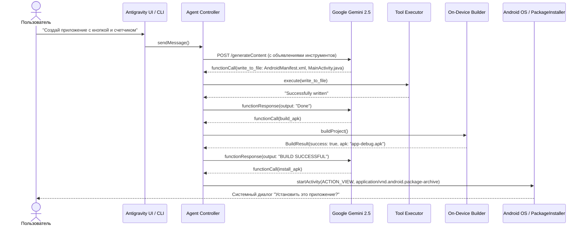

# 🏛 Архитектура Antigravity Mobile

## 1. Схема агентского цикла (Agentic Loop)



## 2. Механизм самовосстановления при ошибках сборки (Self-Healing Loop)

Если агент допускает ошибку (например, обращается к несуществующему `R.id.btn_send` или делает синтаксическую ошибку в Java):
1. `OnDeviceBuilder` перехватывает вывод компилятора (`javac/ecj` или `aapt2`):
   ```text
   MainActivity.java:18: error: cannot find symbol
   Button btn = findViewById(R.id.btn_submit);
                                  ^
   symbol: variable btn_submit
   location: class id
   ```
2. Текст ошибки возвращается агенту Gemini в объекте `functionResponse`.
3. Модель анализирует номер строки и несоответствие между `activity_main.xml` и `MainActivity.java`.
4. Вызывает `replace_file_content` для исправления ID или импортов.
5. Запускает `build_apk` повторно до достижения кода возврата 0.

## 3. Требования к безопасности и правам в Android

- `android.permission.REQUEST_INSTALL_PACKAGES`: Необходимо для вызова системного инсталлятора без ограничений.
- `androidx.core.content.FileProvider`: Требуется современным версиям Android (Android 7.0–15+) для безопасной передачи URI файла (`content://...`) сторонним приложениям и установщику пакетов с флагом `FLAG_GRANT_READ_URI_PERMISSION`.
- Все создаваемые проекты изолированы в песочнице приложения (`context.filesDir/workspace`) или в директории Termux (`~/.antigravity/workspace`), что предотвращает конфликт с другими данными на устройстве.
